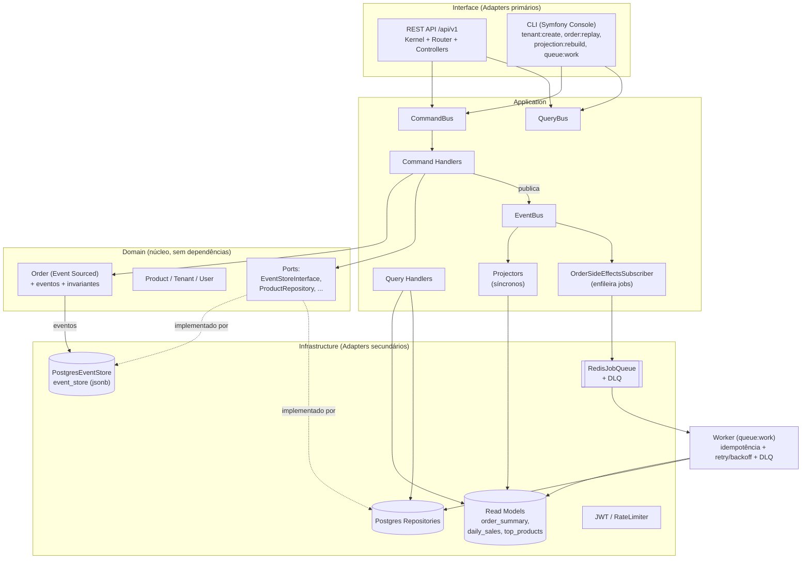

# OrderHub

Plataforma SaaS multi-loja de gestão de pedidos, construída em PHP 8.3 para
demonstrar — de forma justificada pelo domínio — **arquitetura hexagonal**,
**multi-tenancy**, **Event Sourcing**, **CQRS**, **processamento assíncrono via
filas**, **API REST versionada**, **CLI administrativo**, **testes
automatizados**, **containerização** e **CI/CD**.

Cada lojista (tenant) cadastra produtos e recebe pedidos. Um pedido percorre o
ciclo `criado → pago → enviado → entregue` (podendo ser `cancelado` antes do
envio). Ao ser pago, dispara — de forma assíncrona — baixa de estoque, geração
de nota fiscal (PDF simulado), e-mail de confirmação e um webhook opcional por
loja. O dono da loja consulta um dashboard com métricas agregadas.

O agregado `Order` é **event sourced**: seu estado é reconstruído a partir da
sequência de eventos, não de uma linha mutável. `Product` e `Tenant` usam
persistência tradicional — nem todo agregado precisa de event sourcing, só
aquele cujo histórico tem valor de negócio (auditoria de pedidos).

---

## Arquitetura



**Regra de dependência:** `Domain` não depende de nada. `Application` depende de
`Domain`. `Infrastructure` e `Interface` dependem de `Application`/`Domain`.
Nunca o inverso. Nenhuma classe de `Domain` importa framework ou infraestrutura.

### Fluxo de escrita (pagar um pedido)
```
HTTP → OrderController → PayOrderCommand → PayOrderHandler
   → OrderRepository.get() (replay de eventos) → Order.pay() → evento PaymentReceived
   → EventStore.append() (concorrência otimista) → EventBus.publish()
       → Projectors (SÍNCRONO: atualizam read models na mesma request)
       → OrderSideEffectsSubscriber (enfileira 4 jobs no Redis)
```

### Fluxo de leitura
```
HTTP → OrderController → GetOrderSummaryQuery → QueryHandler
   → lê order_summary_projection (read model) → DTO
```

---

## Como rodar localmente

Pré-requisitos: **Docker** e **docker-compose**.

```bash
cd docker
docker-compose up --build
```

Isso sobe quatro serviços: `php` (API em `http://localhost:8080`), `worker`,
`postgres` e `redis`. As migrações (`migrate:up`) rodam automaticamente na
subida da API — são idempotentes.

Popular dados de demonstração (usuário, loja e produtos):

```bash
docker exec orderhub_php php bin/console seed:demo
# imprime e-mail (demo@orderhub.test), senha (password) e o tenant id
```

### Migração e seed manuais
```bash
docker exec orderhub_php php bin/console migrate:up
docker exec orderhub_php php bin/console tenant:create --name="Loja X" --owner-email=foo@bar.com
```

---

## Interface Web

Além da API JSON, o OrderHub tem uma interface Web server-side rendered em
`/app` — Twig + HTMX, sem build step e sem framework JS. Ela **reaproveita os
mesmos Command/Query Handlers da API**; a única coisa que muda é a camada
`Interface`, o que prova na prática que a arquitetura hexagonal suporta
múltiplos canais sem duplicar regra de negócio (ver `src/Interface/Web`).

Depois de `docker-compose up` e `seed:demo`, acesse:

```text
http://localhost:8080/app/login
```

com o e-mail/senha impressos pelo `seed:demo` (`demo@orderhub.test` /
`password`), ou crie sua própria conta em `/app/signup` (usuário + primeira
loja em um passo, sem verificação de e-mail — ver "Desvios" abaixo). As telas
disponíveis:

- **`/app/dashboard`** — mesmas métricas do endpoint `GET /dashboard/summary`.
- **`/app/products`** — listagem (com busca e paginação), criação/edição e
  **exclusão** de produtos (form tradicional + confirmação JS; pedidos
  existentes preservam nome/preço via snapshot em `OrderItem`, não são
  afetados pela exclusão).
- **`/app/orders`** — listagem filtrável por status, com um formulário de
  **criação manual de pedido** (`/app/orders/new`: cliente + múltiplos itens),
  reaproveitando o mesmo `CreateOrderCommand` da API — útil para vendas
  originadas fora do checkout do cliente final (telefone, balcão).
- **`/app/orders/{id}`** — detalhe do pedido com painel de ações via HTMX
  (pagar → enviar → **entregar**, fechando o ciclo de vida completo; cancelar
  fica disponível tanto em `criado` quanto em `pago`, com confirmação
  reforçada nesse segundo caso) e a **timeline de eventos**: a sequência crua
  de eventos do Event Store (`OrderCreated`, `PaymentReceived`, `OrderShipped`,
  `OrderDelivered`, ...), lida diretamente por `GetOrderEventTimelineQuery` — a
  vitrine visual do Event Sourcing já implementado nas Fases 0-9. Uma vez pago,
  o pedido também ganha um link para baixar a nota fiscal (PDF gerado
  assincronamente).
- **`/app/settings`** — nome da loja e URL de webhook (`Tenant::rename()`/
  `configureWebhook()`), histórico das últimas tentativas de entrega do
  webhook (sucesso/falha, código HTTP, erro) e um botão "Testar webhook agora".
- **Trocar de loja** — um dono com mais de uma loja vê um seletor no menu
  lateral (`POST /app/switch-tenant/{tenantId}`) que troca a loja ativa da
  sessão sem exigir novo login.
- **`/app/ops`** ("Ferramentas") — versão Web de `order:replay`,
  `queue:retry-dlq` e `projection:rebuild`, exposta a pedido explícito do
  usuário (ver "Desvios" abaixo — normalmente ficam só no CLI). Reconstrução
  de pedido é restrita à loja logada; reprocessar a DLQ e reconstruir
  projeções agem sobre **toda a instância** (fila e projeções não são
  particionadas por tenant), com aviso e confirmação JS reforçada na tela.

**Sessão (Web) vs JWT (API).** São dois mecanismos de autenticação
propositalmente diferentes. A API é stateless e fala com clientes programáticos,
então usa um JWT no header `Authorization`. A interface Web fala com um
navegador, então usa sessão PHP tradicional (`session_start()`, cookie
`httpOnly`/`sameSite=Lax`, `secure` em produção) — não faz sentido (nem é mais
seguro) guardar um token em `localStorage` para um canal que já tem cookies de
sessão como mecanismo nativo e mais apropriado. Ver `Interface\Web\Http\Session`
e `Interface\Web\Middleware\RequireWebAuthMiddleware`.

**Por que Twig + HTMX em vez de uma SPA.** Escolha deliberada para manter o
projeto 100% PHP, sem Node.js/Webpack/Vite e sem pipeline de build — o foco do
exercício é competência em PHP server-side, não em frontend JS. HTMX (via CDN)
dá a interatividade de trocar fragmentos de HTML (o painel de status de um
pedido) sem recarregar a página inteira e sem escrever uma linha de JavaScript
customizado; toda ação HTMX tem fallback de formulário tradicional (POST +
redirect) para quando o JavaScript está desabilitado.

---

## Como rodar os testes

Os testes usam Postgres e Redis reais. A forma mais simples é executá-los dentro
do ambiente do compose:

```bash
# com o compose no ar:
docker exec orderhub_php composer test      # PHPUnit (unit + integration)
docker exec orderhub_php composer stan      # PHPStan nível 8
docker exec orderhub_php composer cs        # php-cs-fixer (dry-run, PSR-12)
```

- `composer test:unit` — só o domínio/aplicação (sem I/O).
- `composer test:integration` — event store, projeções, API HTTP, dashboard.
- `composer cs:fix` — aplica correções de estilo.

O CI (GitHub Actions, `.github/workflows/ci.yml`) roda `cs`, `stan` e `test` a
cada push, com serviços Postgres e Redis.

---

## Exemplos de chamadas à API

```bash
BASE=http://localhost:8080/api/v1

# 1) Login (após seed:demo)
TOKEN=$(curl -s -X POST $BASE/auth/login \
  -H 'Content-Type: application/json' \
  -d '{"email":"demo@orderhub.test","password":"password"}' | jq -r .token)

# 2) Listar produtos
curl -s $BASE/products -H "Authorization: Bearer $TOKEN" | jq

# 3) Criar um pedido (troque PRODUCT_ID)
ORDER=$(curl -s -X POST $BASE/orders -H "Authorization: Bearer $TOKEN" \
  -H 'Content-Type: application/json' \
  -d '{"customerName":"Ada","customerEmail":"ada@example.com",
       "items":[{"productId":"PRODUCT_ID","quantity":2}]}' | jq -r .id)

# 4) Pagar (dispara os jobs assíncronos)
curl -s -X POST $BASE/orders/$ORDER/pay -H "Authorization: Bearer $TOKEN" \
  -H 'Content-Type: application/json' -d '{"paymentMethod":"pix"}'

# 5) Enviar
curl -s -X POST $BASE/orders/$ORDER/ship -H "Authorization: Bearer $TOKEN" \
  -H 'Content-Type: application/json' -d '{"trackingCode":"BR123"}'

# 6) Entregar — fecha o ciclo de vida do pedido
curl -s -X POST $BASE/orders/$ORDER/deliver -H "Authorization: Bearer $TOKEN"

# 7) Timeline bruta do event store (mesma query usada pela Web)
curl -s $BASE/orders/$ORDER/timeline -H "Authorization: Bearer $TOKEN" | jq

# 8) Nota fiscal (PDF gerado de forma assíncrona ao pagamento)
curl -s $BASE/orders/$ORDER/invoice -H "Authorization: Bearer $TOKEN" -o invoice.pdf

# 9) Detalhe (read model) e dashboard
curl -s $BASE/orders/$ORDER -H "Authorization: Bearer $TOKEN" | jq
curl -s "$BASE/dashboard/summary?topProductsLimit=10" -H "Authorization: Bearer $TOKEN" | jq

# 10) Configurações da loja (nome/webhook) e histórico de entregas
curl -s -X PATCH $BASE/tenants/me -H "Authorization: Bearer $TOKEN" \
  -H 'Content-Type: application/json' -d '{"store_name":"Minha Loja","webhook_url":"https://example.com/hooks"}'
curl -s -X POST $BASE/webhooks/test -H "Authorization: Bearer $TOKEN"
curl -s $BASE/webhooks/deliveries -H "Authorization: Bearer $TOKEN" | jq
```

Um pedido pago (mas ainda não enviado) também pode ser cancelado — `cancel`
aceita `criado` e `pago`, só fica indisponível a partir de `enviado`.

Toda resposta de erro segue `{"error":{"code":"...","message":"..."}}`. Rotas
com escopo de tenant têm rate limit de 100 req/min por tenant (Redis).

A especificação completa das rotas está em [`openapi.yaml`](openapi.yaml).

### Provando o Event Sourcing pela CLI
```bash
# Reconstrói o pedido só a partir do event store, sem tocar em projeções:
docker exec orderhub_php php bin/console order:replay --id=$ORDER

# Apaga e reconstrói uma projeção a partir de todos os eventos (read model é descartável):
docker exec orderhub_php php bin/console projection:rebuild --name=all

# Reprocessa a dead-letter queue:
docker exec orderhub_php php bin/console queue:retry-dlq
```

---

## Decisões arquiteturais

**Por que Event Sourcing só no `Order`.** O histórico de mudanças de um pedido
tem valor de negócio direto (auditoria, reconstrução, dashboard derivado).
`Product` e `Tenant` são CRUD simples: aplicar event sourcing a eles seria custo
de infraestrutura sem retorno. Usa-se a ferramenta onde o domínio pede.

**Por que multi-tenancy por coluna (`tenant_id`) e não por schema.** Uma coluna
discriminadora em todas as tabelas é mais simples de implementar, migrar e
testar do que schema-por-tenant, e suficiente para o escopo. O `tenant_id`
**nunca** vem do corpo da requisição — é lido do JWT autenticado, e toda query
de leitura/escrita é filtrada por ele (ver `TenantGuard`, repositórios
tenant-scoped e o teste `MultiTenancyIsolationTest`).

**Por que CQRS com projeções síncronas.** Os projetores rodam de forma síncrona
logo após o `append` no event store, para o read model nunca aparecer
desatualizado na mesma request. Já os *side effects externos* (e-mail, PDF,
webhook, baixa de estoque) rodam **assíncronos** via fila, pois são lentos e
podem falhar/repetir sem travar a escrita. O dashboard lê projeções
pré-agregadas (`daily_sales`, `top_products`), respondendo em <200ms mesmo com
milhares de pedidos (ver `DashboardPerformanceTest`, 1000 pedidos).

**Idempotência e resiliência da fila.** Cada job tem `job_id` determinístico
(`<tipo>:<orderId>`). O worker consulta a tabela `processed_jobs` antes de
executar (idempotência), aplica retry com backoff exponencial (10s, 60s, 300s)
e, esgotadas 3 tentativas, move para a dead-letter queue `orderhub:dlq`.

### Desvios em relação ao SPEC

1. **Framework HTTP.** O SPEC permitia Slim 4 ou componentes Symfony. Optou-se
   por um **micro-kernel/roteador próprio, sem dependência de framework HTTP**
   (`src/Interface/Api`), para deixar a arquitetura hexagonal totalmente visível
   e evitar mágica de framework — em linha com a instrução "evitar full-stack
   framework para não esconder a arquitetura". O Symfony Console é usado apenas
   na CLI, como pedido.

2. **`firebase/php-jwt` `^7.1` em vez de `^6.10`.** As versões 6.10.0–6.11.1
   estão sob advisory de segurança (`PKSA-y2cr-5h3j-g3ys`). Subiu-se para a linha
   7.x, sem advisories. A API usada (`JWT::encode`/`decode` HS256) é equivalente.
   Consequência: a chave HMAC precisa ter comprimento adequado (use um
   `JWT_SECRET` longo — ver `.env.example`).

3. **Usuários, `seed:demo` e `migrate:up`.** Além dos comandos mínimos do SPEC,
   há um agregado `User` (necessário para o login), o comando `migrate:up`
   (referenciado pelo compose) e um `seed:demo` de conveniência. O
   `tenant:create` cria o usuário dono caso ele não exista, gerando e exibindo
   uma senha.

4. **Resolução de tenant no JWT.** Um usuário pode ter várias lojas, mas o token
   é escopado a uma. O JWT sempre carrega `user_id`; o `tenant_id` é resolvido no
   login (tenant solicitado, senão a única/primeira loja, senão nenhum). Rotas
   tenant-scoped exigem `tenant_id` no token; `POST /tenants` não (é o endpoint
   que cria a primeira loja).

5. **Estado "pagamento pendente".** Não é um estado persistido distinto: o pedido
   fica em `criado` aguardando pagamento, então o SPEC "pagamento pendente"
   colapsa em `criado`.

6. **Agregação de vendas.** `daily_sales`/`top_products` contam pedidos **pagos**.
   Cancelamentos após o pagamento não estornam a agregação (simplificação
   consciente; o read model é reconstruível caso a regra evolua).

7. **`composer.json` fixa `config.platform.php = 8.3.0`** para resolução de
   dependências reprodutível e compatível com o runtime alvo.

8. **Front controller único.** O SPEC do frontend Web previa um `public/index.php`
   próprio; para não duplicar o roteamento HTTP nem manter dois docroots, o
   front controller em `public/index.php` despacha para `Api\Kernel` (prefixo
   `/api/v1`) ou `Web\Kernel` (prefixo `/app`) conforme o path, reaproveitando o
   mesmo `Container`. O antigo `src/Interface/Api/public/index.php` foi
   removido; o docroot do PHP embutido passou a ser `public/`.

9. **Campos de formulário em inglês (`email`/`password`).** O SPEC descreve o
   login Web como "e-mail + senha" em prosa, mas os nomes de campo seguem a
   convenção já usada em todo o resto do código (`customerName`, `priceCents`,
   etc.) em vez de introduzir a única exceção em português.

10. **Signup self-service (`/app/signup`).** A Seção 19 do SPEC marcava isso
    como fora de escopo (onboarding/cobrança/verificação de e-mail é decisão de
    produto separada). Implementado a pedido explícito do usuário, mas mantendo
    o resto da ressalva original: sem verificação de e-mail, sem cobrança —
    é literalmente `RegisterUserCommand` + `CreateTenantCommand` atrás de um
    formulário público, nada além disso.

11. **Ferramentas de ops na Web (`/app/ops`).** A Seção 19 também descrevia
    isso como risco de segurança desnecessário — e continua sendo. Implementado
    a pedido explícito do usuário mesmo assim. `queue:retry-dlq` e
    `projection:rebuild` **não são tenant-scoped na infraestrutura** (a fila
    Redis e as projeções não são particionadas por loja), então qualquer
    usuário autenticado que acesse essa tela pode reprocessar jobs ou
    reconstruir projeções de **outros tenants**, não só da própria loja. Isso é
    mitigado com um aviso explícito e confirmação JS reforçada na tela, **não**
    com controle de acesso — este projeto não modela um papel de "admin"
    distinto de "dono de loja". Documentado aqui para deixar claro que esse é
    um trade-off consciente de escopo de portfólio, não um descuido: um reuso
    além de portfólio precisaria de um papel de admin de verdade antes disso
    ir para produção.

---

## Estrutura de pastas

```text
src/
  Domain/          # núcleo: Order (ES), Product, Tenant, User, eventos, VOs, ports
  Application/     # CommandBus/QueryBus, handlers, projectors, read models, fila, auth
  Infrastructure/  # Postgres, Redis, JWT, webhook, logging, container (composition root)
  Interface/
    Api/           # Kernel, Router, Controllers, middleware (JSON, JWT)
    Web/           # Kernel, Controllers, Middleware (HTML/Twig, sessão) — ver "Interface Web"
    Cli/           # comandos Symfony Console
templates/         # Twig: layout, partials, telas de auth/dashboard/products/orders
public/            # front controller único (index.php) + assets estáticos (CSS)
tests/
  Unit/            # domínio + aplicação (sem I/O)
  Integration/     # event store, projeções, API HTTP, Web HTTP, dashboard
  Support/         # test doubles (clocks, in-memory stores, stubs)
docker/            # Dockerfile + docker-compose
```
